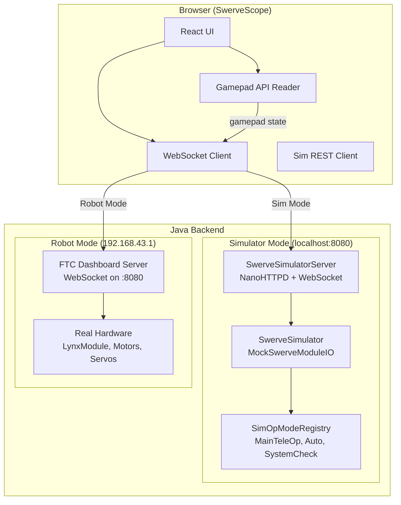

# SwerveScope: Unified Dashboard & Simulator

A Vite + React web app that replaces the existing monolithic `index.html` sim with a professional-grade dashboard inspired by **FTC Dashboard**, **FTControl Panels**, and **AdvantageScope**. It operates in two modes from a single UI: **Simulator Mode** (offline, driving mocked hardware through the real Java pipeline) and **Robot Mode** (connected to the Control Hub, streaming live telemetry, controlling OpModes, and sending gamepad inputs).

## User Review Required

> [!IMPORTANT]
> **Naming**: The project is called "SwerveScope" throughout this plan. The Vite app will live at `swerve-scope/` in the repo root (sibling to `TeamCode/`). Confirm this is the right location or if you prefer it inside `TeamCode/src/test/resources/`.

> [!IMPORTANT]
> **Robot-side server**: To support Robot Mode (live telemetry, OpMode control), the Control Hub needs a WebSocket server. This plan assumes we install **FTC Dashboard** (`com.acmerobotics.dashboard`) as a Gradle dependency since its server is already battle-tested. If you'd prefer a custom lightweight server or want to use **FTControl Panels** instead, that changes Phase 4 significantly.

> [!WARNING]
> **Scope**: This is a large project. The plan is phased so you can ship a working product after Phase 1-2 and incrementally add robot connectivity. Phases 3-5 are stretch goals that can be deferred.

## Open Questions

1. **FTC Dashboard dependency**: Are you comfortable adding `com.acmerobotics.dashboard:dashboard:0.5.1` to your `build.dependencies.gradle`? This gives us the WebSocket server, config variable injection, and telemetry streaming for free. The alternative is writing a custom NanoHTTPD WebSocket server (more work, fewer features).

2. **Limelight panel**: Do you want a dedicated Limelight camera stream panel in the dashboard? FTControl Panels has this, but it requires the Limelight's HTTP stream endpoint to be accessible from the browser (which it is when on robot WiFi).

3. **Recording/Replay**: AdvantageScope's killer feature is recording telemetry to files and replaying them. Do you want this in Phase 3 or is it out of scope?

---

## Architecture Overview



### Dual-Mode Connection Strategy

The UI auto-detects which mode to use:

```typescript
// ConnectionManager.ts
const ROBOT_IP = '192.168.43.1'; // Control Hub
const SIM_IP = 'localhost';
const PORT = 8080;

async function detectMode(): Promise<'robot' | 'sim'> {
  try {
    const res = await fetch(`http://${ROBOT_IP}:${PORT}/api/status`, {
      signal: AbortSignal.timeout(1500)
    });
    if (res.ok) return 'robot';
  } catch {}
  
  try {
    const res = await fetch(`http://${SIM_IP}:${PORT}/api/status`, {
      signal: AbortSignal.timeout(1500)
    });
    if (res.ok) return 'sim';
  } catch {}
  
  return 'sim'; // Fallback to sim
}
```

The user can also manually toggle between modes in the UI header.

---

## Phase 1: Vite + React Foundation & Simulator Migration

**Goal**: Replace the single `index.html` with a proper Vite React app that reproduces all existing sim functionality with a dramatically better UI.

### Frontend Setup

#### [NEW] `swerve-scope/package.json`
```json
{
  "name": "swerve-scope",
  "private": true,
  "version": "1.0.0",
  "scripts": {
    "dev": "vite",
    "build": "vite build",
    "preview": "vite preview"
  },
  "dependencies": {
    "react": "^19.1.0",
    "react-dom": "^19.1.0"
  },
  "devDependencies": {
    "@vitejs/plugin-react": "^4.4.1",
    "vite": "^6.3.2"
  }
}
```

#### Design System

The UI follows a dark theme inspired by AdvantageScope's professional look with glassmorphism elements from Panels:

```css
/* Core tokens */
:root {
  --bg-primary: #0f1117;
  --bg-secondary: #161822;
  --bg-panel: #1c1e2e;
  --bg-card: #232538;
  --border: rgba(255, 255, 255, 0.06);
  --text-primary: #e8eaed;
  --text-secondary: #9aa0a6;
  --accent: #7c4dff;
  --accent-glow: rgba(124, 77, 255, 0.15);
  --success: #00e676;
  --warning: #ffd740;
  --danger: #ff5252;
  --module-color: #ff9100;
  --robot-color: #448aff;
  --font-mono: 'JetBrains Mono', 'Fira Code', monospace;
  --font-sans: 'Inter', -apple-system, sans-serif;
  --radius-sm: 8px;
  --radius-md: 12px;
  --radius-lg: 16px;
}
```

#### App Layout

```
┌─────────────────────────────────────────────────────────────┐
│  ⚡ SwerveScope    [Sim Mode ▼]    [MainTeleOp ▼]  ● INIT  │  ← Header
├───────────────────────────────────┬─────────────────────────┤
│                                   │  📊 Telemetry           │
│       🏟️ Field / Robot View       │  ─────────────────────  │
│                                   │  key: value             │
│   (Canvas-rendered robot with     │  key: value             │
│    module vectors, trail, field)  │  ─────────────────────  │
│                                   │  📈 Graphs              │
│                                   │  ─────────────────────  │
│                                   │  [time-series charts]   │
├───────────────────────────────────┼─────────────────────────┤
│  🎮 Gamepad    │  📋 Modules     │  ⚙️ Config Variables    │
│  [L] [R] sticks│  FL  FR  BR  BL │  STEER_P: [0.325]      │
│  [D-pad status]│  angle/speed/pwr│  HEADING_P: [1.0]      │
└────────────────┴─────────────────┴─────────────────────────┘
```

### Component Hierarchy

```
App
├── Header
│   ├── ConnectionIndicator (sim/robot, latency)
│   ├── OpModeSelector (dropdown)
│   └── OpModeControls (INIT / START / STOP)
├── MainLayout (resizable panels)
│   ├── FieldView (canvas-rendered field + robot)
│   ├── TelemetryPanel
│   │   ├── TelemetryTable (key-value pairs)
│   │   └── GraphView (time-series line charts)
│   ├── GamepadPanel
│   │   ├── StickVisualizer (×2)
│   │   ├── ButtonStatus (d-pad, bumpers, etc.)
│   │   └── GamepadDetector
│   ├── ModulePanel
│   │   └── ModuleCard (×4, angle/speed/power)
│   └── ConfigPanel
│       └── ConfigVariable (editable, auto-syncs)
```

### Java Backend Changes (Simulator Server)

#### [MODIFY] [SwerveSimulatorServer.java](file:///c:/Users/ajayp/Downloads/FTCcode%20-%20Copy/TeamCode/src/test/java/org/firstinspires/ftc/teamcode/Swerve/Sim/SwerveSimulatorServer.java)

Upgrade from HTTP polling to **WebSocket** for real-time bidirectional communication. Add OpMode management.

Key changes:
- Add WebSocket support via NanoWSD (NanoHTTPD's WebSocket extension)
- Add `/api/opmodes` endpoint returning list of registered OpModes
- Add `/api/opmode/select` to switch active OpMode
- Add `/api/opmode/control` for INIT/START/STOP state transitions
- Add `/api/config` for reading and writing `SwerveConfig` fields via reflection
- Broadcast state snapshots at 50Hz via WebSocket instead of polling

```java
// WebSocket message protocol
// Client → Server:
{"type": "gamepad", "data": {...}}
{"type": "opmode_select", "name": "MainTeleOp"}
{"type": "opmode_control", "action": "INIT" | "START" | "STOP"}
{"type": "config_update", "key": "STEER_P", "value": 0.4}

// Server → Client:
{"type": "state", "data": {...snapshot...}}
{"type": "opmodes", "data": ["MainTeleOp", "Auto", "SwerveSystemCheck"]}
{"type": "opmode_status", "name": "MainTeleOp", "state": "RUNNING"}
{"type": "config", "data": {"STEER_P": 0.325, "HEADING_P": 1.0, ...}}
{"type": "telemetry", "data": {"Loop Hz": "48.2", ...}}
```

#### [NEW] `SimOpModeRegistry.java`

Manages simulated OpModes that run against MockSwerveModuleIO:

```java
public class SimOpModeRegistry {
    private final Map<String, Supplier<SimOpMode>> registry = new LinkedHashMap<>();
    private SimOpMode activeOpMode;
    private OpModeState state = OpModeState.STOPPED;
    
    public SimOpModeRegistry() {
        register("MainTeleOp", SimMainTeleOp::new);
        register("Auto (Preload)", SimAuto::new);
        register("SwerveSystemCheck", SimSystemCheck::new);
    }
    
    public enum OpModeState { STOPPED, INITIALIZED, RUNNING }
    
    public void select(String name) { ... }
    public void init() { ... }
    public void start() { ... }
    public void stop() { ... }
    public void loop(double dt) { ... }
}
```

#### [NEW] `SimMainTeleOp.java`

A simulated OpMode that mirrors the real `MainTeleOp` logic but uses mock hardware:

```java
public class SimMainTeleOp implements SimOpMode {
    private SwerveSimulator sim;
    private Map<String, String> telemetry = new LinkedHashMap<>();
    
    @Override
    public void init(SwerveSimulator sim) {
        this.sim = sim;
        telemetry.put("Status", "Initialized");
    }
    
    @Override
    public void loop(BrowserGamepadState gamepad, double dt) {
        // Mirror MainTeleOp logic: field-centric, controller, drivetrain
        sim.step(dt);
        
        // Populate telemetry map
        telemetry.put("Loop Hz", String.format("%.1f", 1.0 / dt));
        telemetry.put("Heading", String.format("%.1f°", Math.toDegrees(sim.getHeading())));
        telemetry.put("Drivetrain State", sim.getDrivetrainState());
        // ... per-module telemetry
    }
    
    @Override
    public Map<String, String> getTelemetry() { return telemetry; }
}
```

---

## Phase 2: Canvas Field View & Telemetry Graphing

**Goal**: A canvas-rendered field with robot visualization (not DOM elements) and real-time time-series graphs.

### FieldView Component

Replace the current DOM-based robot rendering with a `<canvas>` that draws:
1. **FTC Field**: 12ft × 12ft field with tile grid lines (actual game field image optional)
2. **Robot Chassis**: Polygon outline with front-edge indicator, scaled to real dimensions
3. **Module Vectors**: Lines showing current angle and target angle per module, with speed encoded as length
4. **Pose Trail**: Fading polyline of recent positions (last 200 points)
5. **Vision Cone**: If Limelight data is present, draw the camera FOV

```typescript
// FieldView.tsx - Canvas rendering at 60fps
function drawRobot(ctx: CanvasRenderingContext2D, state: RobotState) {
  ctx.save();
  ctx.translate(fieldToCanvasX(state.pose.x), fieldToCanvasY(state.pose.y));
  ctx.rotate(-state.pose.heading); // CCW positive
  
  // Chassis outline
  const hw = TRACK_WIDTH_PX / 2;
  const hl = WHEEL_BASE_PX / 2;
  ctx.strokeStyle = 'rgba(68, 138, 255, 0.8)';
  ctx.lineWidth = 2;
  ctx.strokeRect(-hw, -hl, TRACK_WIDTH_PX, WHEEL_BASE_PX);
  
  // Front edge
  ctx.strokeStyle = '#ff5252';
  ctx.lineWidth = 4;
  ctx.beginPath();
  ctx.moveTo(-hw, -hl);
  ctx.lineTo(hw, -hl);
  ctx.stroke();
  
  // Module vectors
  for (const mod of state.modules) {
    drawModuleVector(ctx, mod);
  }
  
  ctx.restore();
}
```

### GraphView Component

Time-series line charts for telemetry values using a lightweight canvas renderer (no chart library dependency):

```typescript
interface GraphConfig {
  key: string;         // telemetry key to graph
  color: string;       // line color
  yMin?: number;       // auto-scale if not set
  yMax?: number;
  windowSeconds: number; // time window (default 10s)
}

// Default graphs for swerve:
const DEFAULT_GRAPHS: GraphConfig[] = [
  { key: 'actualVelocity.linearSpeed', color: '#00e676', windowSeconds: 10 },
  { key: 'actualVelocity.omega', color: '#ff9100', windowSeconds: 10 },
  { key: 'modules[0].drivePower', color: '#448aff', windowSeconds: 10 },
  { key: 'loopHz', color: '#7c4dff', windowSeconds: 10 },
];
```

The graph panel supports:
- Drag-to-select which telemetry keys to graph
- Auto-scaling Y axis
- Pause/resume
- Hover to see exact value at a point in time
- Multiple series overlaid

### Swerve Module Visualization

A dedicated panel showing 4 module "gauges" inspired by AdvantageScope's swerve widget:

```
┌──────────────────────────────────────────┐
│  Front Left            Front Right       │
│  ┌───────────┐         ┌───────────┐     │
│  │  ◎ →      │         │      ← ◎  │     │
│  │ 42.1°     │         │   -38.7°  │     │
│  │ 0.82 m/s  │         │ 0.79 m/s  │     │
│  │ pwr: 0.61 │         │ pwr: 0.58 │     │
│  └───────────┘         └───────────┘     │
│  Back Left             Back Right        │
│  ┌───────────┐         ┌───────────┐     │
│  │  ◎ →      │         │      ← ◎  │     │
│  │ 45.0°     │         │   -44.2°  │     │
│  │ 0.80 m/s  │         │ 0.81 m/s  │     │
│  │ pwr: 0.60 │         │ pwr: 0.60 │     │
│  └───────────┘         └───────────┘     │
└──────────────────────────────────────────┘
```

Each module shows:
- A circular gauge with an arrow showing current angle and a ghost arrow showing target angle
- Speed bar (percentage of max)
- Drive power value
- Stall indicator (red border if stalled)

---

## Phase 3: OpMode Management & Config Variables

**Goal**: Select, initialize, start, and stop simulated OpModes from the dashboard. Edit `SwerveConfig` values live.

### OpMode Selector

A dropdown in the header that lists all registered OpModes (from `SimOpModeRegistry`). Groups them into:
- **TeleOp**: MainTeleOp
- **Autonomous**: Auto (Preload)
- **Test**: SwerveSystemCheck, SwerveModulePIDTune

State machine controls below the dropdown:

```
[  INIT  ]  →  [ START ]  →  [  STOP  ]
   gray         green           red
```

Mirrors the Driver Station flow. The sim server manages the lifecycle.

### Config Variable Panel

Uses Java reflection on `SwerveConfig` to discover all `public static` fields. The server serializes them on connect and the client renders editable inputs:

```java
// ConfigReflector.java
public static Map<String, Object> readConfig() {
    Map<String, Object> config = new LinkedHashMap<>();
    for (Field f : SwerveConfig.class.getDeclaredFields()) {
        if (Modifier.isPublic(f.getModifiers()) && Modifier.isStatic(f.getModifiers())) {
            config.put(f.getName(), f.get(null));
        }
    }
    return config;
}

public static void writeConfig(String key, Object value) {
    Field f = SwerveConfig.class.getDeclaredField(key);
    if (f.getType() == double.class) f.setDouble(null, ((Number) value).doubleValue());
    else if (f.getType() == boolean.class) f.setBoolean(null, (Boolean) value);
    // ... arrays, etc.
}
```

The React UI renders each config field as an appropriate input:
- `double` → number input with step=0.01
- `boolean` → toggle switch
- `double[]` → array of number inputs (for OFFSETS, etc.)

Changes are sent over WebSocket and applied immediately. The sim uses the updated values on the next loop tick.

---

## Phase 4: Robot Mode (Live Connectivity)

**Goal**: When connected to the robot's WiFi, the same UI reads live telemetry from the FTC Dashboard WebSocket server, sends gamepad inputs, and controls real OpModes.

### Prerequisites

Add FTC Dashboard as a Gradle dependency:

```gradle
// build.dependencies.gradle
implementation 'com.acmerobotics.dashboard:dashboard:0.5.1'
```

Then in your OpModes, use `FtcDashboard.getInstance()` to get the dashboard telemetry object. The dashboard server automatically starts on port 8080 when any OpMode is initialized.

### Connection Manager

```typescript
// hooks/useConnection.ts
type ConnectionMode = 'sim' | 'robot' | 'disconnected';

function useConnection() {
  const [mode, setMode] = useState<ConnectionMode>('disconnected');
  const [ws, setWs] = useState<WebSocket | null>(null);
  
  // Auto-detect on mount
  useEffect(() => {
    detectMode().then(detected => {
      const host = detected === 'robot' ? ROBOT_IP : SIM_IP;
      const socket = new WebSocket(`ws://${host}:${PORT}/ws`);
      socket.onopen = () => setMode(detected);
      socket.onclose = () => setMode('disconnected');
      setWs(socket);
    });
  }, []);
  
  return { mode, ws, reconnect };
}
```

### Protocol Adapter

Since FTC Dashboard and our sim server use different WebSocket protocols, we need an adapter layer:

```typescript
interface DashboardMessage {
  // Telemetry, config, OpMode state — same shape regardless of source
  telemetry: Record<string, string>;
  config: Record<string, ConfigValue>;
  opModeState: 'STOPPED' | 'INIT' | 'RUNNING';
  activeOpMode: string;
  availableOpModes: string[];
  robotState?: RobotState; // Only in sim mode (full module data)
}

class ProtocolAdapter {
  constructor(private mode: ConnectionMode) {}
  
  // Normalizes FTC Dashboard messages and Sim messages into a common shape
  parse(raw: string): DashboardMessage { ... }
  
  // Converts UI actions into the right protocol
  sendGamepad(state: GamepadState): string { ... }
  sendOpModeControl(action: string): string { ... }
  sendConfigUpdate(key: string, value: any): string { ... }
}
```

### Sim-Only vs Robot-Only Panels

| Panel | Sim Mode | Robot Mode |
|-------|----------|------------|
| Field View | ✅ Simulated pose + modules | ✅ From telemetry (if pose is logged) |
| Telemetry | ✅ From SimOpMode | ✅ From FTC Dashboard |
| Graphs | ✅ From SimOpMode | ✅ From FTC Dashboard |
| Gamepad Input | ✅ Sent to sim | ✅ Sent to robot (if dashboard supports it) |
| Module Vectors | ✅ Full mock data | ⚠️ Only if telemetry logs module angles |
| Config Variables | ✅ Via reflection | ✅ Via FTC Dashboard `@Config` |
| OpMode Control | ✅ Sim lifecycle | ✅ Via FTC Dashboard |
| Camera Stream | ❌ | ✅ If Limelight/webcam available |

---

## Phase 5: Recording, Replay & Export (Stretch)

**Goal**: Record telemetry sessions to IndexedDB, replay them with variable-speed scrubbing, and export to CSV.

### Session Recorder

```typescript
interface TelemetryFrame {
  timestampMs: number;
  data: Record<string, number | string>;
  robotState?: RobotState;
}

class SessionRecorder {
  private frames: TelemetryFrame[] = [];
  private recording = false;
  private db: IDBDatabase;
  
  startRecording() { this.frames = []; this.recording = true; }
  
  addFrame(frame: TelemetryFrame) {
    if (this.recording) this.frames.push(frame);
  }
  
  async stopAndSave(name: string) {
    this.recording = false;
    // Store to IndexedDB
    const tx = this.db.transaction('sessions', 'readwrite');
    tx.objectStore('sessions').add({ name, date: Date.now(), frames: this.frames });
  }
  
  exportCSV(sessionName: string): string {
    // All keys as columns, all frames as rows
  }
}
```

### Replay Engine

- Timeline scrubber at the bottom of the screen
- Play/pause, 0.25x/0.5x/1x/2x/4x speed
- All panels (field view, graphs, telemetry) sync to the playback cursor
- Click on a graph point to jump to that time

---

## Proposed Changes Summary

### Frontend (New Vite App)

#### [NEW] `swerve-scope/` directory
- `package.json`, `vite.config.ts`, `index.html`
- `src/App.tsx` — Root layout with panel system
- `src/index.css` — Design system (dark theme, tokens)
- `src/components/Header.tsx` — Mode indicator, OpMode selector, controls
- `src/components/FieldView.tsx` — Canvas-rendered field + robot
- `src/components/TelemetryPanel.tsx` — Key-value telemetry table
- `src/components/GraphView.tsx` — Time-series charts (canvas)
- `src/components/GamepadPanel.tsx` — Stick visualizers + button status
- `src/components/ModulePanel.tsx` — 4× module gauges
- `src/components/ConfigPanel.tsx` — Editable config variables
- `src/hooks/useConnection.ts` — WebSocket + mode detection
- `src/hooks/useGamepad.ts` — Gamepad API reader
- `src/lib/ConnectionManager.ts` — Dual-mode connection logic
- `src/lib/ProtocolAdapter.ts` — Message normalization
- `src/lib/SessionRecorder.ts` — Recording + IndexedDB

---

### Java Backend (Sim Server Upgrades)

#### [MODIFY] [SwerveSimulatorServer.java](file:///c:/Users/ajayp/Downloads/FTCcode%20-%20Copy/TeamCode/src/test/java/org/firstinspires/ftc/teamcode/Swerve/Sim/SwerveSimulatorServer.java)
- Add NanoWSD WebSocket support
- Add OpMode management endpoints
- Add config reflection endpoints
- Serve built Vite output or proxy to dev server

#### [MODIFY] [SwerveSimulator.java](file:///c:/Users/ajayp/Downloads/FTCcode%20-%20Copy/TeamCode/src/test/java/org/firstinspires/ftc/teamcode/Swerve/Sim/SwerveSimulator.java)
- Extract OpMode-specific logic into `SimOpMode` implementations
- Add telemetry map generation
- Support OpMode lifecycle (init/start/stop)

#### [NEW] `Sim/SimOpMode.java` — Interface for simulated OpModes
#### [NEW] `Sim/SimOpModeRegistry.java` — OpMode registration and lifecycle
#### [NEW] `Sim/SimMainTeleOp.java` — Simulated MainTeleOp
#### [NEW] `Sim/SimAuto.java` — Simulated autonomous (preload path)
#### [NEW] `Sim/SimSystemCheck.java` — Simulated diagnostics OpMode
#### [NEW] `Sim/ConfigReflector.java` — SwerveConfig reflection utilities

#### [DELETE] `swerve-sim/index.html` — Replaced by the Vite app

---

### Robot-Side (Phase 4 only)

#### [MODIFY] `build.dependencies.gradle`
- Add FTC Dashboard Maven repository and dependency

#### [MODIFY] Various OpModes
- Add `FtcDashboard` telemetry integration where needed
- Annotate `SwerveConfig` with `@Config` for live editing

---

## Verification Plan

### Automated Tests
- `npm run build` in `swerve-scope/` compiles without errors
- `.\\gradlew :TeamCode:testDebugUnitTest` passes (existing tests unbroken)
- `.\\gradlew :TeamCode:compileDebugJavaWithJavac` passes

### Manual Verification
- **Phase 1**: Run `npm run dev` + Java sim server. Verify gamepad input drives the robot on the canvas field. Verify telemetry table updates. Verify module panel shows correct data.
- **Phase 2**: Verify time-series graphs render smoothly. Verify pose trail renders on the field canvas.
- **Phase 3**: Verify OpMode selection works. Verify config variable editing updates sim behavior in real-time.
- **Phase 4**: Connect to robot WiFi. Verify telemetry streams in. Verify OpMode controls work.

### Browser Testing
- Open in Chrome with a connected Xbox/DualShock controller
- Verify gamepad is detected and inputs map correctly
- Verify keyboard fallback (WASD + JL) still works

---

## Implementation Order

| Phase | Scope | Effort | Dependencies |
|-------|-------|--------|-------------|
| **1** | Vite scaffold, layout, sim migration, WebSocket | 2-3 sessions | None |
| **2** | Canvas field, graphs, module gauges | 1-2 sessions | Phase 1 |
| **3** | OpMode management, config panel | 1-2 sessions | Phase 2 |
| **4** | Robot mode, FTC Dashboard integration | 1-2 sessions | Phase 3 + robot |
| **5** | Recording, replay, CSV export | 1-2 sessions | Phase 4 (optional) |

Phase 1 + 2 alone deliver a dramatically better sim than what exists today. Phases 3-5 build on that foundation incrementally.
