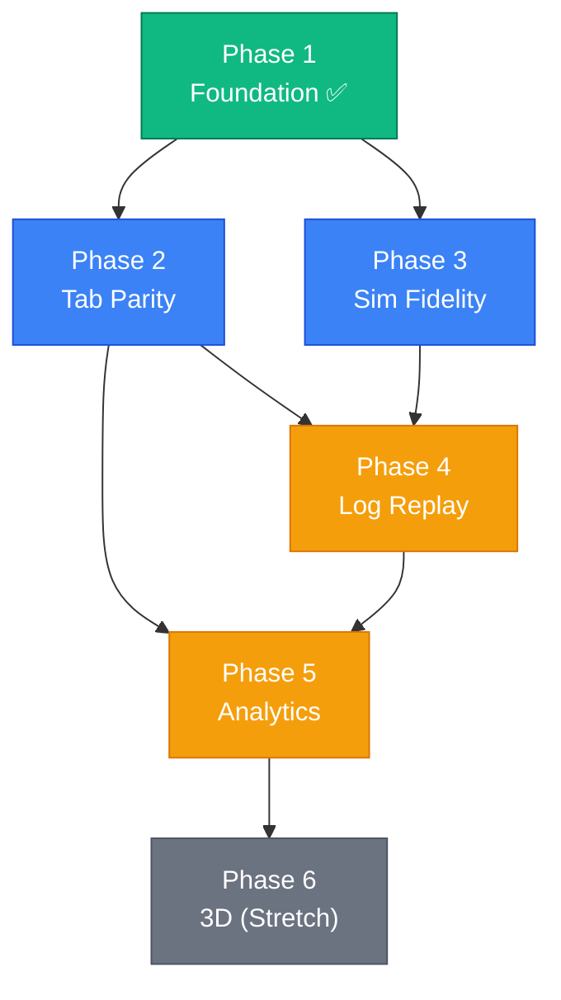

# SwerveScope — Master Implementation Plan

> **Mission**: A desktop diagnostic workbench that lets you test **every code change before touching the robot**. SwerveScope emulates the swerve modules and drivetrain independently of the production code — your Java brain runs unmodified, SwerveScope's virtual hardware reflects exactly what the code commands it to do, and you see the result instantly.

> Inspired by FRC Team 6328's [AdvantageScope](https://docs.advantagescope.org/), tailored for our custom FTC swerve drivetrain.

---

## Architecture Overview

```
┌──────────────────────────────────────────────────────────┐
│                   SwerveScope (Electron + React)         │
│                                                          │
│  ┌──────────┐ ┌───────────┐ ┌──────────┐ ┌───────────┐  │
│  │ 2D Arena │ │ Swerve    │ │ Line     │ │ Console   │  │
│  │ / 3D     │ │ Detailer  │ │ Graphs   │ │ / Table   │  │
│  └────┬─────┘ └─────┬─────┘ └────┬─────┘ └─────┬─────┘  │
│       └──────────────┴───────────┴──────────────┘        │
│                     ▲  Telemetry Frames                  │
│  ┌──────────────────┴──────────────────────────────────┐ │
│  │          WebSocket Bridge (ws://localhost:8080)      │ │
│  └──────────────────┬──────────────────────────────────┘ │
└─────────────────────┼────────────────────────────────────┘
                      │ JSON (50 Hz)
┌─────────────────────┼────────────────────────────────────┐
│   Java SITL Server  │  (SwerveSimServer.java)            │
│   ┌─────────────────▼───────────────────────────────┐    │
│   │      PRODUCTION CODE (SwerveController,         │    │
│   │   SwerveKinematics, MotionSmoother, Auditor)    │    │
│   └─────────────────┬───────────────────────────────┘    │
│   ┌─────────────────▼───────────────────────────────┐    │
│   │   VIRTUAL HARDWARE EMULATORS                    │    │
│   │   • Steering motor lag (angular velocity cap)   │    │
│   │   • Drive motor lag (acceleration cap)          │    │
│   │   • Pose integrator (from measured states)      │    │
│   └─────────────────────────────────────────────────┘    │
└──────────────────────────────────────────────────────────┘
```

### Key Principle: Emulate the Hardware, Not the Code

The Java SITL server runs the **exact same** `SwerveController`, `SwerveKinematics`, `MotionSmoother`, and `SwerveAuditor` classes that run on the robot. The only difference is that instead of commanding real servos and motors, it commands **virtual hardware emulators** that simulate:

| Emulated Behavior | What It Models | Current Implementation |
|---|---|---|
| **Steering lag** | CRServo angular velocity limit (720°/s) | `SwerveSimServer.java` L120-128 |
| **Drive acceleration** | Motor inertia (15 m/s² cap) | `SwerveSimServer.java` L130-133 |
| **Pose integration** | Pinpoint odometry (from measured states) | `SwerveSimServer.java` L136-143 |
| **Current draw** | Load-based Amp estimation | `SwerveLogic.ts` (TS-side only) |

When you change a PID gain, add a new control mode, or refactor kinematics — run the SITL server, drive with a gamepad, and see *exactly* what the robot would do.

---

## What Already Exists (Phase 1 Foundation ✅)

### Java Side (TeamCode/src/test/.../Tests/)
- ✅ `SwerveSimServer.java` — WebSocket SITL server running production code at 50Hz
- ✅ Virtual hardware emulators (steering lag, drive acceleration, pose integrator)
- ✅ Gamepad input forwarding from browser → Java
- ✅ Cardinal snap commands (D-pad → heading targets)
- ✅ 13 unit/integration tests covering kinematics, PID, smoother, observer, geometry

### TypeScript Side (swerve-scope/src/)
- ✅ `SwerveSim.tsx` — 2D canvas arena with grid, odometry trail, module vectors (target vs actual)
- ✅ `SwerveLogic.ts` — Full TS port of kinematics, auditor, smoother, observer, pinpoint emulator
- ✅ `MosaicShell.tsx` — react-mosaic drag-and-drop tiling window manager
- ✅ `TelemetryPanel.tsx` — Table + Terminal views with module state readouts
- ✅ `SwerveScopes.tsx` — uPlot line graph (FL module target vs actual velocity)
- ✅ `App.tsx` — Frame buffer (30K entries), scrubber timeline, live/history mode toggle
- ✅ Electron desktop shell (`main.cjs`)
- ✅ CSV export

### Tech Stack (Installed)
| Package | Purpose | Status |
|---|---|---|
| React 19 | UI framework | ✅ |
| react-mosaic-component | Tiling layout | ✅ |
| uPlot | High-perf line graphs | ✅ |
| Electron 41 | Desktop shell | ✅ |
| Vite 8 | Dev/build tooling | ✅ |
| lucide-react | Icons | ✅ |
| dexie | IndexedDB wrapper | ✅ Installed, unused |
| mathjs | Expression engine | ✅ Installed, unused |
| dsp.js | FFT/signal processing | ✅ Installed, unused |
| tailwindcss 4 | Styling | ✅ |

---

## Phase 2: AdvantageScope Tab Parity

> **Goal**: Implement dedicated visualization tabs matching AdvantageScope's core feature set, adapted for our swerve data model.

### 2A — 🦀 Swerve Detailer Tab `[NEW component]`
AdvantageScope's signature view. A dedicated 4-module vector display with chassis speeds.

- [ ] **4-Pane Module View**: Each module rendered as:
  - Velocity vector arrow (scaled to max speed)
  - Steering angle indicator (current rotation)
  - Speed magnitude label (m/s)
  - Angle label (degrees)
- [ ] **Target vs Actual Overlay**: Semi-transparent red arrows (target) behind solid green arrows (actual) per module
- [ ] **Chassis Speeds Center Display**: Resultant linear velocity vector + angular velocity arc in the center of the robot footprint
- [ ] **Traction Circle**: Circle per module showing friction budget utilization (speed ÷ max speed)
- [ ] **Configurable Parameters** (sidebar):
  - Max speed (for vector scaling)
  - Robot frame dimensions
  - Color scheme (target/actual)

> **Data source**: `TelemetryEntry.targets[]` and `TelemetryEntry.actuals[]` — already streamed from SITL.

### 2B — 📉 Line Graph Tab (Enhanced) `[MODIFY SwerveScopes.tsx]`
Currently plots only FL module velocity. Needs to be a general-purpose drag-and-drop graph like AdvantageScope.

- [ ] **Multi-Series Support**: Plot any combination of telemetry fields simultaneously
- [ ] **Field Selector Sidebar**: Tree view of all available telemetry keys — drag a key onto the graph to add it as a series
  - Pose: `x`, `y`, `heading`
  - Per-module (×4): `target_speed`, `target_angle`, `actual_speed`, `actual_angle`
  - Controller state: `isSnapping`, `isMaintaining`
  - (Future) `current_draw`, `loop_time`, `observer_vx`, `observer_vy`
- [ ] **Dual Y-Axis**: Left axis for speeds (m/s), right axis for angles (deg) or custom units
- [ ] **Cursor Crosshair**: Vertical time-cursor synchronized with the global scrubber
- [ ] **Range Selection**: Click-drag to select a time range for statistical analysis
- [ ] **Auto-Scaling**: Y-axis auto-fits to the visible data window

### 2C — 🗺 2D Field View `[MODIFY SwerveSim.tsx]`
Upgrade the current canvas arena into a proper field visualization.

- [ ] **12' × 12' FTC Field**: Accurate tile boundaries and measurement grid
- [ ] **Pose Ghosting**: Render the **target pose** as a semi-transparent ghost overlaid on the **actual pose** (the "Control Gap")
- [ ] **Odometry Trail History**: Already exists — enhance with configurable trail length and color gradient (fade older points)
- [ ] **Coordinate Readout**: Mouse hover shows field coordinates in inches and meters
- [ ] **Zoom & Pan**: Scroll-to-zoom with middle-click-to-pan
- [ ] **Reset View**: Double-click to reset to default zoom/center

### 2D — 🎮 Joystick Visualizer Tab `[NEW component]`
Shows the driver's raw gamepad inputs and the processed outputs after filtering.

- [ ] **Dual-Stick Display**: Visual representation of both joystick positions
  - Left stick: drive/strafe (translation)
  - Right stick: turn (rotation)
- [ ] **Raw vs Filtered**: Show both the raw gamepad input AND the post-LPF filtered value
- [ ] **Button State Overlay**: D-pad directions and other buttons highlighted when pressed
- [ ] **Input History Trail**: Short trail showing recent stick positions (last ~0.5s)

> **Data requirement**: Extend `SwerveSimServer` to also broadcast raw gamepad values in the telemetry frame.

### 2E — 📊 Statistics Tab `[NEW component]`
Select a time range on any graph and compute statistics over that window.

- [ ] **Summary Statistics**: Mean, Median, Std Dev, Min, Max, RMS Error
- [ ] **Histogram**: Distribution chart for any selected field over the selected range
- [ ] **Comparison Mode**: Side-by-side stats of target vs actual for any module

### 2F — 🔢 Table Tab `[ENHANCE TelemetryPanel.tsx]`
Currently shows the latest frame's module states. Extend to show full historical data.

- [ ] **Scrollable History Table**: All telemetry entries in a sortable, filterable table
- [ ] **Column Selection**: Choose which fields to display
- [ ] **Row Highlighting**: Click a row to jump the global scrubber to that timestamp
- [ ] **Color Coding**: Cells turn red/yellow when values exceed thresholds (e.g., high current)

### 2G — 💬 Console Tab `[NEW component]`
The terminal view in TelemetryPanel is a start — extract it into a proper console.

- [ ] **Log Levels**: Filter by INFO, WARNING, ERROR, DEBUG
- [ ] **Keyword Search**: Real-time filtering of console messages
- [ ] **Auto-Scroll Toggle**: Lock to bottom or free-scroll
- [ ] **Timestamp Display**: Absolute time and relative-to-start
- [ ] **Java Logger Integration**: Stream `Logger.java` output over the WebSocket

---

## Phase 3: Enhanced Simulation Fidelity

> **Goal**: Make the virtual hardware emulators realistic enough that you can trust the simulation results.

### 3A — Improved Module Emulators `[MODIFY SwerveSimServer.java]`

The current emulators use simple acceleration caps. Add physics-informed models:

- [ ] **Feedforward Physics Model**: Apply the same `V = kS + kV·v + kA·a` model the real `SwerveModule.java` uses
  - Static friction threshold (kS = 1.05V)
  - Back-EMF proportional to velocity (kV = 4.2 V/(m/s))
  - Inertial load proportional to acceleration (kA = 0.45 V/(m/s²))
- [ ] **Battery Voltage Simulation**: Model voltage sag under load (starting at 12.0V, dropping with aggregate current draw)
- [ ] **Steering PID Emulation**: Instead of a simple angular velocity cap, emulate the PID + CRServo response curve with a realistic settling time (~50ms to target)
- [ ] **Encoder Noise**: Add configurable Gaussian noise to the odometry integrator
- [ ] **X-Stance Emulation**: Simulate the WAITING_TO_LOCK → LOCKED state transition from `SwerveDrivetrain.java`

### 3B — Extended Telemetry Protocol `[MODIFY SwerveSimServer.java]`

Broadcast additional diagnostic data to enable all visualization tabs:

- [ ] **New Fields in JSON Frame**:
  ```json
  {
    "timestamp": 12345,
    "x": 0.0, "y": 0.0, "heading": 0.0,
    "targets": [[0.0, 0.0], [0.0, 0.0], [0.0, 0.0], [0.0, 0.0]],
    "actuals": [[0.0, 0.0], [0.0, 0.0], [0.0, 0.0], [0.0, 0.0]],
    "isMaintaining": false,
    "isSnapping": false,
    "gamepad": { "lx": 0.0, "ly": 0.0, "rx": 0.0, "buttons": [] },
    "smootherState": { "vx": 0.0, "vy": 0.0, "omega": 0.0, "ax": 0.0, "ay": 0.0 },
    "observerVel": { "vx": 0.0, "vy": 0.0, "omega": 0.0 },
    "currentDraw": [0.0, 0.0, 0.0, 0.0],
    "batteryVoltage": 12.0,
    "loopTimeMs": 20,
    "drivetrainState": "DRIVING"
  }
  ```
- [ ] **Update `TelemetryEntry` TypeScript type** to match

### 3C — Standalone Simulation Mode `[NEW: SwerveLogic.ts enhancement]`

Allow SwerveScope to run **without** the Java SITL server, using the TypeScript swerve logic port:

- [ ] **TS-Only Mode**: When no WebSocket is connected, run the full simulation loop in the browser
- [ ] **Keyboard Controls**: WASD for drive/strafe, Q/E for rotation (when no gamepad available)
- [ ] **Parameter Tweaking UI**: Live sliders for PID gains, max speed, LPF gains — instantly see the effect
- [ ] **Mode Indicator**: Clear UI badge showing "SITL // Java" vs "LOCAL // TypeScript"

---

## Phase 4: Data Persistence & Log Replay

> **Goal**: Record sessions, save logs, and replay them like AdvantageScope's log file viewer.

### 4A — Session Recording `[ENHANCE App.tsx]`

- [ ] **Flight Recorder**: Always buffer the last 10 minutes of telemetry in memory (30K frames @ 50Hz — already implemented)
- [ ] **Save Session**: One-click save to IndexedDB via Dexie
  - Metadata: date, duration, description tag
  - Full frame data array
- [ ] **Session Browser**: List saved sessions with search/filter/delete
- [ ] **Load & Replay**: Load a saved session and scrub through it using the existing timeline

### 4B — File Import/Export `[NEW]`

- [ ] **CSV Export**: Already works — enhance with column selection
- [ ] **CSV Import**: Load external CSV data files for analysis
- [ ] **.sslog Binary Format** (stretch goal):
  - Header: `[4B magic, 4B version, 8B startTimestamp]`
  - Frames: packed Float32 arrays for O(1) seeking
  - ~60% smaller than equivalent JSON, instant random access

### 4C — Global Timeline Enhancements `[MODIFY App.tsx footer]`

- [ ] **Playback Controls**: Play/Pause/Step-Forward/Step-Back buttons
- [ ] **Playback Speed**: 0.25×, 0.5×, 1×, 2×, 4× speed control
- [ ] **Frame Counter**: Display current frame number and total frames
- [ ] **Time Labels**: Show MM:SS.ms timestamps on scrubber
- [ ] **Marker System**: Drop named markers on the timeline ("PID oscillation here")

---

## Phase 5: Deep Diagnostics & Analytics

> **Goal**: Advanced analysis tools for serious tuning work.

### 5A — FFT Analysis Pane `[NEW component]`

Using `dsp.js` (already installed):

- [ ] **Frequency Domain View**: Run FFT on any time-series telemetry field
- [ ] **Use Cases**:
  - Detect PID oscillation frequency → tune Kd accordingly
  - Identify mechanical vibration harmonics
  - Find MotionSmoother jerk resonance
- [ ] **Windowed FFT**: Apply to the selected time range only

### 5B — Expression Engine `[NEW component]`

Using `mathjs` (already installed):

- [ ] **Custom Calculated Fields**: Define virtual telemetry fields using math expressions:
  ```
  pid_error = target_speed_FL - actual_speed_FL
  slip_ratio = (target_speed_FL - actual_speed_FL) / max(target_speed_FL, 0.01)
  total_current = current_0 + current_1 + current_2 + current_3
  ```
- [ ] **Expression Builder UI**: Field selector + text input for formula
- [ ] **Plot on Graphs**: Calculated fields appear as plottable series on the Line Graph tab

### 5C — Auto-Tuning Profiler `[NEW component]`

- [ ] **Feedforward Calculator**: Given a velocity-step log, automatically calculate:
  - `kS` (static friction): the minimum power that produces motion
  - `kV` (velocity constant): slope of the power-vs-speed line
  - `kA` (acceleration constant): derived from the initial ramp
- [ ] **Guided Routine**: UI wizard that tells you "hold the stick forward for 3 seconds" and captures the data
- [ ] **Results Display**: Show the calculated constants with before/after comparison charts

---

## Phase 6: 3D Visualization (Stretch)

> **Goal**: Premium 3D field view matching AdvantageScope's 3D field tab.

### 6A — Three.js Integration `[NEW: requires three, @react-three/fiber, @react-three/drei]`

- [ ] **3D Chassis Model**: Procedural robot with visible steering modules and wheel spin
- [ ] **Target vs Actual Ghost**: Translucent ghost robot showing where the code *wants* to be
- [ ] **Camera Controls**: Orbit, pan, zoom with trackball controls
- [ ] **12' × 12' Field Model**: Textured floor with tile lines
- [ ] **Cinematic vs Performance Rendering Modes**: Toggle shadows, anti-aliasing

### 6B — Visual Enhancements

- [ ] **Module Current Heatmap**: Color modules by current draw (blue → red)
- [ ] **Velocity Trail Particles**: 3D breadcrumb trail behind the robot
- [ ] **Heading Arrow**: Large arrow showing robot orientation

---

## Phase Priority & Dependencies



| Phase | Priority | Effort | Dependencies |
|---|---|---|---|
| **2: Tab Parity** | 🔴 Critical | ~4 days | Phase 1 ✅ |
| **3: Sim Fidelity** | 🔴 Critical | ~2 days | Phase 1 ✅ |
| **4: Log Replay** | 🟡 High | ~2 days | Phases 2+3 |
| **5: Analytics** | 🟡 High | ~3 days | Phase 4 |
| **6: 3D (Stretch)** | 🟢 Nice-to-have | ~4 days | Phase 5 |

---

## 🛠 Technical Stack Summary

| Layer | Technology | Role |
|---|---|---|
| **Desktop Shell** | Electron 41 | Native window, file system access |
| **Frontend** | React 19 + Vite 8 | Component UI |
| **Styling** | Tailwind CSS 4 | Design system |
| **Layout** | react-mosaic-component | Drag-and-drop tiling |
| **Charts** | uPlot | High-perf line graphs |
| **3D (Phase 6)** | Three.js + R3F | 3D field visualization |
| **Database** | Dexie (IndexedDB) | Session recording & log persistence |
| **Math** | mathjs | Expression engine for calculated fields |
| **Signal** | dsp.js | FFT frequency analysis |
| **Icons** | lucide-react | UI iconography |
| **Sim Brain** | Java (SwerveController + prod classes) | Runs production code unmodified |
| **Bridge** | WebSocket (Java-WebSocket lib) | 50Hz JSON telemetry stream |

---

## File Map

```
FTCcode - Copy/
├── swerve-scope/                          # SwerveScope frontend
│   ├── main.cjs                         # Electron entry
│   ├── src/
│   │   ├── App.tsx                      # Root: frame buffer, scrubber, live/history
│   │   ├── lib/SwerveLogic.ts           # TS port of swerve (standalone sim mode)
│   │   ├── types/telemetry.ts           # TelemetryEntry interface
│   │   ├── components/
│   │   │   ├── MosaicShell.tsx          # Tiling window manager
│   │   │   ├── SwerveSim.tsx            # 2D canvas arena + WS bridge
│   │   │   ├── SwerveScopes.tsx         # uPlot line graph
│   │   │   ├── TelemetryPanel.tsx       # Table + terminal view
│   │   │   ├── Sidebar.tsx              # Toggle controls + snap buttons
│   │   │   ├── SwerveDetailer.tsx       # [PHASE 2A — NEW]
│   │   │   ├── JoystickVisualizer.tsx   # [PHASE 2D — NEW]
│   │   │   ├── StatisticsPanel.tsx      # [PHASE 2E — NEW]
│   │   │   ├── ConsolePanel.tsx         # [PHASE 2G — NEW]
│   │   │   ├── FFTAnalysis.tsx          # [PHASE 5A — NEW]
│   │   │   └── ExpressionEngine.tsx     # [PHASE 5B — NEW]
│   │   └── styles/
│
├── TeamCode/src/
│   ├── main/java/.../Swerve/            # PRODUCTION CODE (runs on robot)
│   │   ├── Core/                        # Config, PID, Math, Logger
│   │   ├── Geometry/                    # Pose, Point, D2Vector
│   │   ├── Hardware/                    # SwerveDrivetrain, SwerveModule, HWMap
│   │   ├── Input/                       # MotionSmoother, JoystickScaling
│   │   ├── Logic/
│   │   │   ├── Control/                 # SwerveController
│   │   │   ├── Kinematics/              # SwerveKinematics, SwerveAuditor, SwerveModuleState
│   │   │   └── Localization/            # SwerveLocalizer, SwerveVelocityObserver
│   │   └── OpModes/                     # SwerveTeleOp, MainTeleOp
│   │
│   └── test/java/.../Swerve/Tests/      # SIMULATION + TESTS
│       ├── SwerveSimServer.java         # SITL WebSocket server
│       ├── SwerveKinematicsTest.java    # Unit tests
│       ├── MotionSmootherTest.java
│       ├── PIDControllerTest.java
│       ├── SwerveVelocityObserverTest.java
│       ├── HeadingRetentionTest.java
│       ├── SwerveStressTest.java
│       └── ...
```

---

## Open Questions

> [!IMPORTANT]
> **Which phase should we start first?** Phases 2 (Tab Parity) and 3 (Sim Fidelity) are independent and can be worked in parallel. Phase 2 gives you more visibility; Phase 3 gives you more accuracy.

> [!NOTE]
> **Standalone TS mode vs Java-only?** Phase 3C proposes a TypeScript-only simulation mode for quick testing without starting the Java server. This is convenient but means maintaining two copies of the swerve logic. Should we prioritize this or keep it Java-only?

> [!NOTE]
> **Autonomous path testing?** The current SITL server only handles teleop (gamepad) inputs. Should we add an autonomous mode where the Java side runs pre-programmed paths and the visualizer shows the robot following them?
